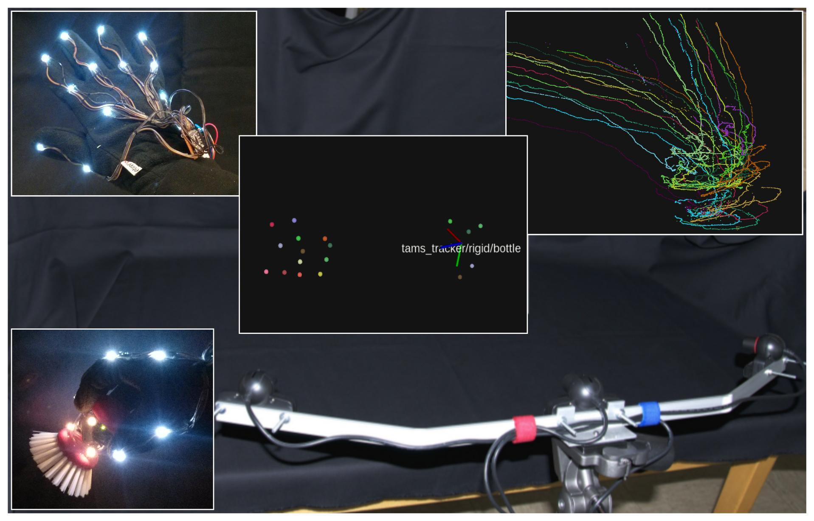
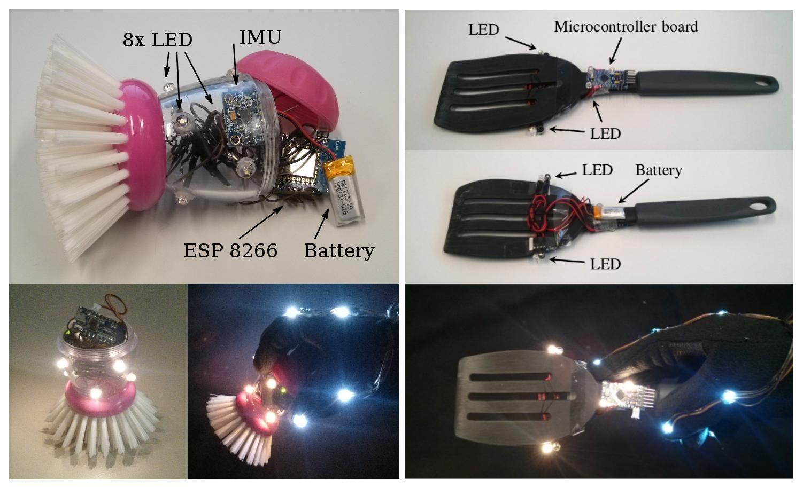
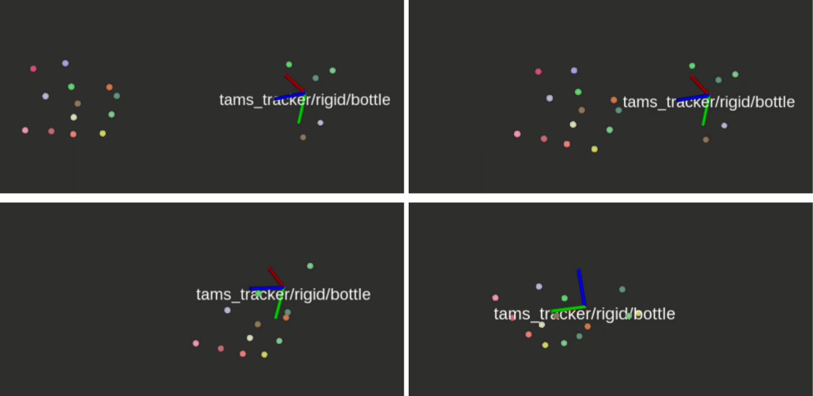
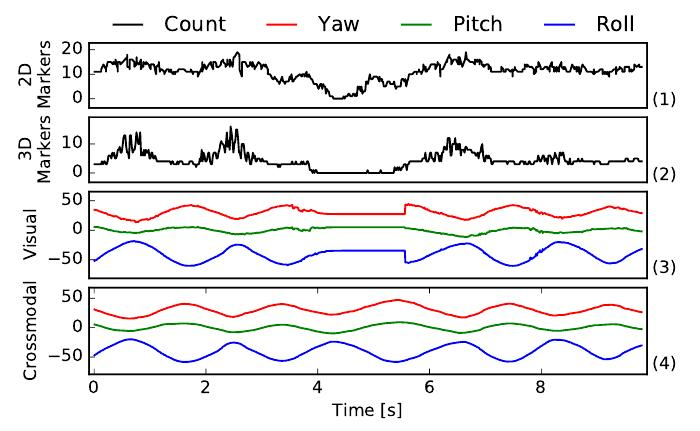
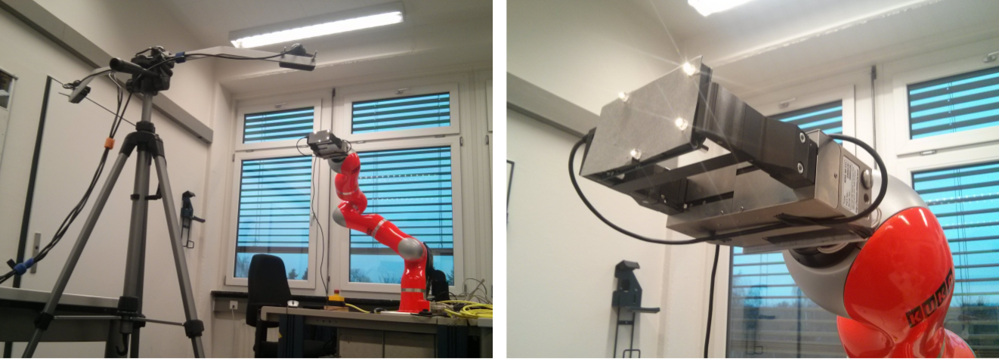
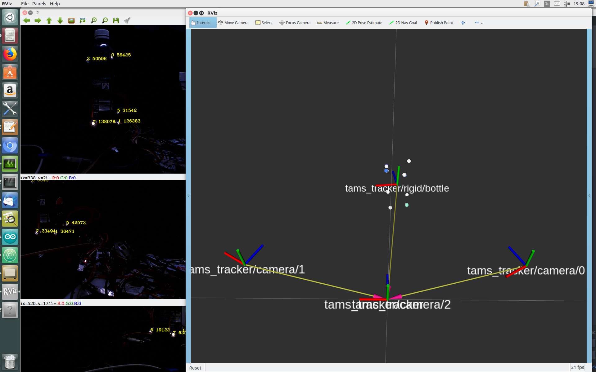

# Low-cost multi-view pose tracking using active markers

- Pulsed LEDs as active markers
- Works with standard webcams
- Fast 2D marker identification
- Robust 3D marker position reconstruction
- Precise 6D rigid object pose reconstruction
- Tracking supports fusion with IMU data
- ROS interface, usable with robots and other sensors
- Fully open-source software

## Instrumented Objects

Teach robots by recording demonstrations of manipulation tasks using instrumented objects and tracking gloves.

## Visual-Inertial Sensor Fusion

Increase reliability under marker occlusions through crossmodal sensor fusion with IMUs.

## Robot Calibration

Use webcams and LEDs to accurately calibrate your robots.

## ROS Integration

Marker positions and object poses are published as ROS messages for easy integration into robot applications and machine learning projects.

